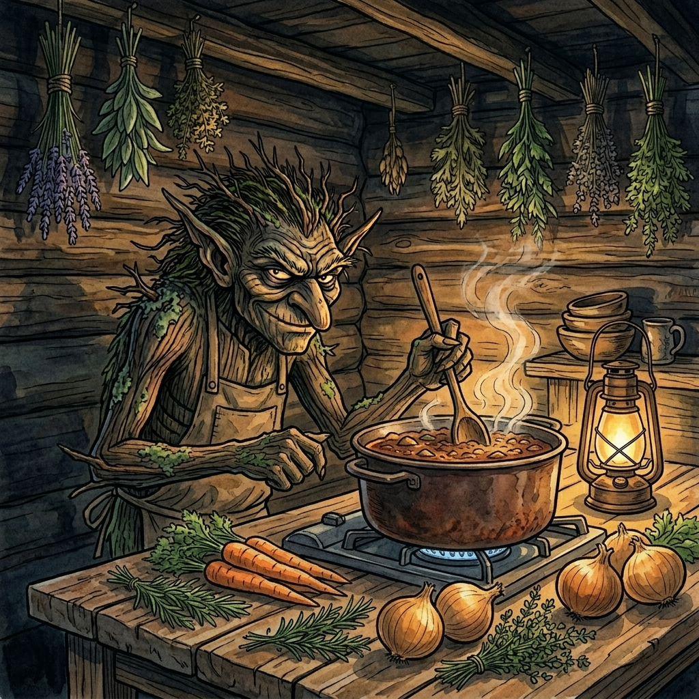

# TilbudsTrolden

[](https://github.com/olgasafonova/tilbudstrolden-mcp/actions/workflows/ci.yml)
[](https://www.typescriptlang.org/)
[](https://opensource.org/licenses/MIT)
[](https://modelcontextprotocol.io)

**The deal troll that lives under the bridge between your fridge and your wallet.**

<p align="center">
  
</p>

An [MCP](https://modelcontextprotocol.io) server that searches Danish grocery chains for current deals, scores your recipes against this week's offers, and builds shopping lists optimized by price and store. You talk to your AI assistant about dinner; the troll does the legwork.

Works with any MCP-compatible client: Claude Desktop, Claude Code, VS Code, Cursor, Windsurf, ChatGPT, and others.

## What can you do with it?

**"What's cheap at Netto right now?"** Browse current offers from any Danish store.

**"Find me the cheapest hakket oksekoed across all stores."** Search deals by keyword and compare unit prices side by side.

**"I want to make osso buco. Where should I buy the ingredients?"** The troll searches for each ingredient across all stores and finds the best match, distinguishing raw cuts from processed deli products. It won't suggest roget laks when you need fresh salmon.

**"Score my recipes against this week's deals."** Save your go-to recipes with Danish search terms per ingredient. The scoring engine checks current offers, ranks recipes by deal coverage, and tells you which meals are cheapest to cook this week.

**"Plan next week's dinners."** Generate an optimized weekly meal plan that minimizes total basket cost while enforcing variety: no protein more than twice, no cuisine more than twice, and a cap on slow-cook nights. Then export a shopping list grouped by store.

**"We already have onions and rice."** Track your pantry. Items you have at home get excluded from shopping lists and scoring.

## Supported stores

Netto, Meny, Lidl, REMA 1000, Foetex, Bilka, Spar, Kvickly, 365discount, and any other chain listed on etilbudsavis.dk.

## Quick start

### Install

```bash
git clone https://github.com/olgasafonova/tilbudstrolden-mcp.git
cd tilbudstrolden-mcp
npm install
npm run build
```

### Connect to your MCP client

Pick your client below. All use stdio transport; no API keys or auth required.

<details>
<summary><strong>Claude Desktop</strong></summary>

Add to `~/Library/Application Support/Claude/claude_desktop_config.json` (macOS) or `%APPDATA%\Claude\claude_desktop_config.json` (Windows):

```json
{
  "mcpServers": {
    "tilbudstrolden": {
      "command": "node",
      "args": ["/absolute/path/to/tilbudstrolden-mcp/dist/server.js"]
    }
  }
}
```

Restart Claude Desktop after saving.
</details>

<details>
<summary><strong>Claude Code</strong></summary>

```bash
claude mcp add tilbudstrolden node /absolute/path/to/tilbudstrolden-mcp/dist/server.js
```
</details>

<details>
<summary><strong>VS Code (Copilot / Cline / Continue)</strong></summary>

Add to your workspace `.vscode/mcp.json`:

```json
{
  "servers": {
    "tilbudstrolden": {
      "command": "node",
      "args": ["/absolute/path/to/tilbudstrolden-mcp/dist/server.js"]
    }
  }
}
```
</details>

<details>
<summary><strong>Cursor</strong></summary>

Add to `~/.cursor/mcp.json`:

```json
{
  "mcpServers": {
    "tilbudstrolden": {
      "command": "node",
      "args": ["/absolute/path/to/tilbudstrolden-mcp/dist/server.js"]
    }
  }
}
```
</details>

<details>
<summary><strong>Windsurf</strong></summary>

Add to `~/.codeium/windsurf/mcp_config.json`:

```json
{
  "mcpServers": {
    "tilbudstrolden": {
      "command": "node",
      "args": ["/absolute/path/to/tilbudstrolden-mcp/dist/server.js"]
    }
  }
}
```
</details>

<details>
<summary><strong>ChatGPT Desktop</strong></summary>

In Settings > MCP Servers, click "Add Server" and enter:

- **Name:** tilbudstrolden
- **Command:** `node`
- **Arguments:** `/absolute/path/to/tilbudstrolden-mcp/dist/server.js`
</details>

<details>
<summary><strong>Any MCP client (generic stdio)</strong></summary>

TilbudsTrolden uses stdio transport. Point your client at:

```
command: node
args: ["/absolute/path/to/tilbudstrolden-mcp/dist/server.js"]
```

Optional environment variable:
```
TILBUDSTROLDEN_DATA=/custom/path/to/data.json
```
</details>

## Tools

### Deals
| Tool | Description |
|------|-------------|
| `search_deals` | Search current offers across all Danish stores by keyword |
| `get_store_offers` | Browse this week's offers from a specific store |
| `list_stores` | List available grocery chains |

### Household & Pantry
| Tool | Description |
|------|-------------|
| `get_household` / `update_household` | Configure household members, dietary restrictions, preferred stores, default servings |
| `get_pantry` / `update_pantry` | Track what you have at home (excluded from shopping lists) |

### Recipes
| Tool | Description |
|------|-------------|
| `add_recipe` / `get_recipes` / `remove_recipe` | Save recipes with ingredients, Danish search terms, complexity, cuisine type, and protein type |

### Planning
| Tool | Description |
|------|-------------|
| `score_recipes` | Score all saved recipes against current deals; optionally generate an optimized weekly meal plan with variety constraints (protein, cuisine, complexity) |
| `generate_shopping_list` | Build a deal-optimized shopping list from selected recipes, grouped by store |

### Tracking
| Tool | Description |
|------|-------------|
| `log_meal` / `get_meal_history` | Record what you cooked and when |
| `log_spend` / `get_spend_log` | Track grocery spending over time |

## Example workflow

**1. Set up your household**

Tell your AI assistant: *"We're two people, I'm lactose-free, and we prefer Netto and Meny."*

**2. Add some recipes**

*"Save a recipe for pasta bolognese: 500g hakket oksekoed, 400g tomater, pasta, log."*

The assistant saves it with Danish search terms so deals can be matched automatically.

**3. Score against this week's deals**

*"Score my recipes. What's cheapest to cook this week?"*

The troll fetches current offers, matches ingredients, and ranks recipes by deal coverage and estimated cost.

**4. Generate a shopping list**

*"Make a shopping list for bolognese and the fish tacos."*

Output is grouped by store, with deal prices and validity dates.

## How deal matching works

Danish grocery deals bundle products in creative ways ("Rejer, kold- eller varmroget laks"). The scoring engine classifies products as raw or processed using Danish food terminology. Searching for "laks" as a cooking ingredient won't match roget laks or palaeg. Store preferences from your household config influence ranking, so your closest stores get priority.

The optimizer for weekly meal plans uses brute-force search for small recipe sets (12 or fewer) and a greedy algorithm for larger sets. Variety constraints prevent the same protein or cuisine from appearing more than twice, and cap the number of slow-cook nights.

## Data storage

All data (household, recipes, pantry, meal history, spending) lives in `~/.tilbudstrolden.json`. Override the path with the `TILBUDSTROLDEN_DATA` environment variable.

The file is created automatically on first use. No database or external service required.

## Development

```bash
npm install          # install dependencies
npm run dev          # watch mode with tsx
npm run build        # compile TypeScript
npm run lint         # run Biome linter
npm run typecheck    # strict TypeScript check
npm test             # run tests (Vitest)
```

## Requirements

- Node.js 18 or later
- No API keys needed (etilbudsavis.dk is a public API)

## Powered by

Deal data from [etilbudsavis.dk](https://etilbudsavis.dk).

Starter recipe ingredient lists adapted from [valdemarsro.dk](https://valdemarsro.dk). Uncle Roger recipes from [Nigel Ng's YouTube](https://www.youtube.com/@mrnigelng) ([Egg Fried Rice](https://www.youtube.com/watch?v=SGBP3sG3a9Y), [Adobo](https://www.youtube.com/watch?v=KKpWGnkO3e4)). Bulgogi recipe from [Maangchi](https://www.maangchi.com/recipe/bulgogi). Swedish family recipes from [jarfors.com](https://jarfors.com/recipe).

## License

[MIT](LICENSE)
