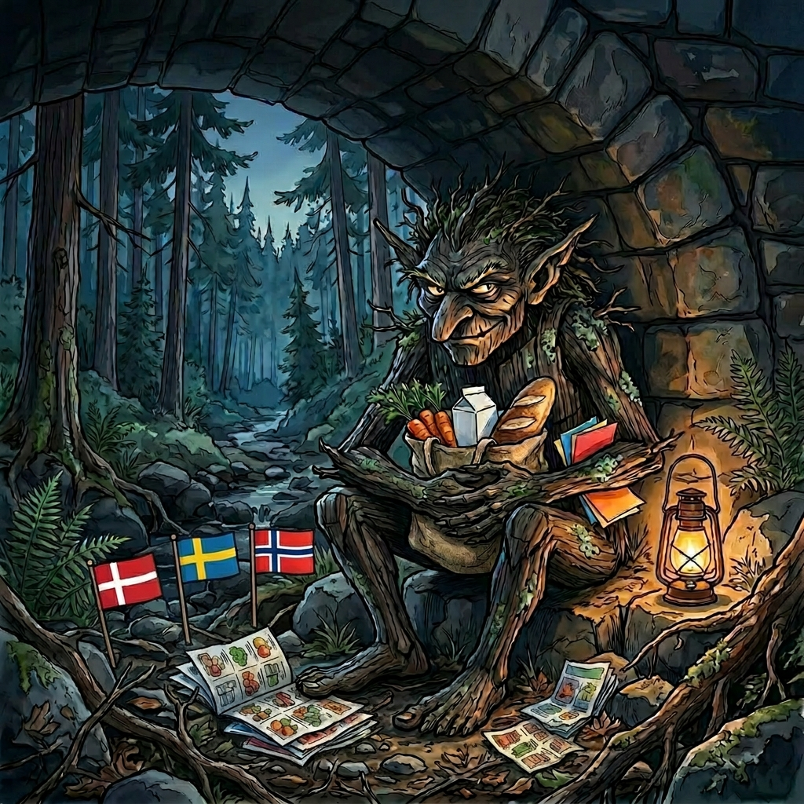

# TilbudsTrolden

[](https://github.com/olgasafonova/tilbudstrolden-mcp/actions/workflows/ci.yml)
[](https://www.typescriptlang.org/)
[](https://opensource.org/licenses/MIT)
[](https://modelcontextprotocol.io)

**The deal troll that lives under the bridge between your fridge and your wallet.**

<p align="center">
  
  &nbsp;&nbsp;
  
</p>

An [MCP](https://modelcontextprotocol.io) server for Nordic grocery shopping. It finds the best deals across supermarkets in **Denmark**, **Norway**, **Sweden**, and **Finland**, plans your weekly dinners around what's cheap, and builds shopping lists grouped by store. You talk to your AI assistant about dinner; the troll does the legwork.

Works with any MCP-compatible client: Claude Desktop, Claude Code, VS Code, Cursor, Windsurf, ChatGPT, and others.

## Features

### Deal search

Search current deals across grocery chains in Denmark, Norway, Sweden, and Finland. Compare unit prices (kr/kg for Scandinavian kroner, €/kg for Finnish euros) side by side. Check what's on offer at a specific store, or get a combined view from all your preferred stores at once.

### Recipe library

Ships with 32 starter recipes (Danish households) spanning Danish, Italian, Asian, Mexican, and Swedish cuisines. Deals are matched to ingredients automatically. Add your own recipes in your local language, remove ones you don't like, or tweak the defaults. Norwegian, Swedish, and Finnish households start with a clean slate for adding recipes with local search terms.

### Meal planning

Plan your week's dinners. The planner checks current deals, picks the cheapest combination of recipes, and makes sure you're not eating chicken four nights in a row. You set the rules: no pork, slow-cook only on weekends, at least 3 Asian dishes this week. It handles the rest.

### Shopping lists

Get a shopping list from any set of recipes. Shared ingredients are added up across recipes (8 carrots, not "2 for this + 3 for that + 3 for the other"). Pantry items are excluded. Current deals are matched per ingredient and grouped by store.

### Household config

Tell the assistant which country you're in (DK, NO, SE, or FI), how many people you're cooking for, which stores you prefer, and any dietary restrictions. Everything else follows from that: deals from your stores rank higher, pork disappears if you said no pork, and shopping lists scale to your household. Country defaults to Denmark if not set.

### Pantry tracking

Tell the assistant what you already have at home. Those items get skipped in shopping lists, so you don't come home with a third bottle of soy sauce.

### Meal and spend logging

Record what you cooked and what you spent. The planner keeps track so you don't end up eating lasagne every Tuesday.

## Supported stores

**Denmark:** Netto, Meny, Lidl, REMA 1000, Foetex, Bilka, Spar, Kvickly, 365discount

**Norway:** REMA 1000, KIWI, Meny, Coop Prix, Extra, Bunnpris, Obs, Spar, Joker

**Sweden:** ICA (Maxi/Kvantum/Supermarket/Nara), Willys, Hemkop, City Gross, Coop, Stora Coop, Tempo

**Finland:** S-market, K-Market, K-Supermarket, K-Citymarket, Prisma, Lidl, Tokmanni, Alepa, Sale, Halpahalli, Minimani, Saiturinpörssi

All deal data is fetched via the [etilbudsavis.dk](https://etilbudsavis.dk) (Tjek) API, which serves flyer data for all four countries. Coverage varies; Denmark has the deepest data, followed by Finland, Sweden, and Norway.

## Quick start

### Install

```bash
git clone https://github.com/olgasafonova/tilbudstrolden-mcp.git
cd tilbudstrolden-mcp
npm install
npm run build
```

### Connect to your MCP client

Pick your client below. All use stdio transport; no API keys or auth required.

<details>
<summary><strong>Claude Desktop</strong></summary>

Add to `~/Library/Application Support/Claude/claude_desktop_config.json` (macOS) or `%APPDATA%\Claude\claude_desktop_config.json` (Windows):

```json
{
  "mcpServers": {
    "tilbudstrolden": {
      "command": "node",
      "args": ["/absolute/path/to/tilbudstrolden-mcp/dist/server.js"]
    }
  }
}
```

Restart Claude Desktop after saving.
</details>

<details>
<summary><strong>Claude Code</strong></summary>

```bash
claude mcp add tilbudstrolden node /absolute/path/to/tilbudstrolden-mcp/dist/server.js
```
</details>

<details>
<summary><strong>VS Code (Copilot / Cline / Continue)</strong></summary>

Add to your workspace `.vscode/mcp.json`:

```json
{
  "servers": {
    "tilbudstrolden": {
      "command": "node",
      "args": ["/absolute/path/to/tilbudstrolden-mcp/dist/server.js"]
    }
  }
}
```
</details>

<details>
<summary><strong>Cursor</strong></summary>

Add to `~/.cursor/mcp.json`:

```json
{
  "mcpServers": {
    "tilbudstrolden": {
      "command": "node",
      "args": ["/absolute/path/to/tilbudstrolden-mcp/dist/server.js"]
    }
  }
}
```
</details>

<details>
<summary><strong>Windsurf</strong></summary>

Add to `~/.codeium/windsurf/mcp_config.json`:

```json
{
  "mcpServers": {
    "tilbudstrolden": {
      "command": "node",
      "args": ["/absolute/path/to/tilbudstrolden-mcp/dist/server.js"]
    }
  }
}
```
</details>

<details>
<summary><strong>ChatGPT Desktop</strong></summary>

In Settings > MCP Servers, click "Add Server" and enter:

- **Name:** tilbudstrolden
- **Command:** `node`
- **Arguments:** `/absolute/path/to/tilbudstrolden-mcp/dist/server.js`
</details>

<details>
<summary><strong>Any MCP client (generic stdio)</strong></summary>

TilbudsTrolden uses stdio transport. Point your client at:

```
command: node
args: ["/absolute/path/to/tilbudstrolden-mcp/dist/server.js"]
```

Optional environment variable:
```
TILBUDSTROLDEN_DATA=/custom/path/to/data.json
```
</details>

## Tools

### Deals
| Tool | What it does |
|------|-------------|
| `search_deals` | Search current offers across stores by keyword (DK/NO/SE/FI) |
| `get_store_offers` | List this week's offers from a specific store |
| `deals_this_week` | Show the best deals from your preferred stores, with expiring items and biggest savings |
| `list_stores` | List available grocery chains with dealer IDs |

### Household and pantry
| Tool | What it does |
|------|-------------|
| `get_household` | View current household config |
| `update_household` | Set country (DK/NO/SE/FI), household members, dietary restrictions, preferred stores, servings |
| `get_pantry` | View pantry contents |
| `update_pantry` | Add or remove pantry items (excluded from shopping lists) |

### Recipes
| Tool | What it does |
|------|-------------|
| `get_recipes` | List all saved recipes |
| `add_recipe` | Save a new recipe with ingredients, search terms (in your language), complexity, cuisine, and protein type |
| `remove_recipe` | Delete a recipe by name |

### Planning
| Tool | What it does |
|------|-------------|
| `score_recipes` | Score all recipes against current deals, ranked by deal coverage |
| `plan_and_shop` | Score, plan a week, and generate a shopping list in one step |
| `generate_shopping_list` | Build a shopping list from specific recipes, with deals matched per ingredient |

### Tracking
| Tool | What it does |
|------|-------------|
| `log_meal` | Record what you cooked and when |
| `get_meal_history` | View past meals |
| `log_spend` | Record grocery spending |
| `get_spend_log` | View spending history |

## Starter recipes

TilbudsTrolden ships with 32 recipes that work out of the box. They're loaded on first use and fully editable; add your own or remove any you don't need.

**Danish** (13): Frikadeller, Brændende Kærlighed, Kylling i Karry, Laks i fad, Flæskesteg, Tomatsuppe, Hakkebøffer med bløde løg, Kartoffelsuppe, Fiskefilet med remoulade, Biksemad, Koteletter i fad, Bagt kylling med ovnkartofler, Pølsegryde

**Italian** (6): Spaghetti Bolognese, Lasagne, Spaghetti Carbonara, Tomatrisotto, Salsiccia Pasta, Marry Me Chicken

**Asian** (7): Wok med kylling, Nudelsuppe med kylling, Uncle Roger's Egg Fried Rice, Nasi Goreng, Chow Mein, Uncle Roger's Adobo, Maangchi's Bulgogi

**Mexican** (2): Chili con Carne, Tacos med kylling

**Swedish** (4): Kajsas Kycklingfile med senap och rosepeber, Grillet laks med tomatsmor, Sagas Krydderisauce, Fransk grillet kylling med dragonsauce

Complexity ranges from quick (15-20 min) through medium (30-45 min) to slow (1+ hour). Proteins cover chicken, beef, pork, fish, egg, and vegetarian.

## Example conversations

Real examples of how you'd talk to your AI assistant with TilbudsTrolden running.

### Set up your household

> **You:** We're 3 people, no pork, and we shop at Netto, REMA 1000, and Meny.

The assistant saves your setup. From now on, deals from Netto, REMA, and Meny get priority, and pork recipes are excluded from meal plans.

> **You:** Switch me to Finland. We shop at Prisma, K-Supermarket, and Lidl.

Country becomes FI, stores update, and deals now come from Finnish chains. Prices show in €/kg instead of kr/kg.

### Check deals

> **You:** What's on sale at my stores this week?

You get a summary per store: expiring deals that need action, biggest savings, and highlights.

> **You:** Find me the cheapest hakket oksekoed.

```
Found 6 deals for "hakket oksekød":
1. Hakket okse- eller grisekød - 99 DKK (76.15 kr/kg) @ Bilka
2. Hakket oksekød 8-12% - 36.66 DKK (91.65 kr/kg) @ Fleggaard
3. Velsmag hakket oksekød 7-10% - 45 DKK (112.50 kr/kg) @ Netto
...
```

### Plan a full week

> **You:** Plan next week's dinners. No pork except Tuesday, mix of Asian and other.

You get a 7-day plan with no consecutive protein or cuisine repeats, plus a shopping list for the whole week.

```
7-day meal plan (3 people)

Mon: Tomatrisotto (Italian, vegetarian)
Tue: Chow Mein (Asian, pork)
Wed: Laks i fad (Danish, fish)
Thu: Maangchi's Bulgogi (Asian, beef)
Fri: Fiskefilet med remoulade (Danish, fish)
Sat: Lasagne (Italian, beef)
Sun: Nudelsuppe med kylling (Asian, chicken)

Shopping list (58 items)
Buy at Netto: hakket oksekød 45 DKK, kyllingebrystfilet 49 DKK, ...
Buy at REMA: oksemørbrad 129.95 DKK, remoulade 10 DKK, ...
Buy at regular price: mozzarella, parmesan, kokosmælk, ...
```

### Add your own recipe

> **You:** Save a recipe for chicken tikka masala: 500g kyllingebryst, 200g yoghurt, tikka masala paste, hakkede tomater, piskefloede, ris. Medium, Indian, chicken.

The recipe is saved. It shows up in meal plans and deal matching from now on.

### Shopping list for specific meals

> **You:** Make a shopping list for bolognese and tacos, 4 people.

Shared ingredients (like onions used in both) are aggregated. Pantry items are excluded.

### Track pantry

> **You:** We have rice, soy sauce, and sesame oil at home.

These items get skipped in future shopping lists.

### Log what you cooked

> **You:** We made the bulgogi tonight, spent 185 kr at REMA.

No bulgogi for a while.

## How deal matching works

Nordic grocery deals bundle products in creative ways ("Rejer, kold- eller varmroget laks"). TilbudsTrolden tells raw ingredients apart from processed products using language-specific food terminology for Danish, Norwegian, Swedish, and Finnish. Searching for "laks" as a cooking ingredient won't match roget/rokt/rokt laks or palaeg/palegg/palagg, and searching for "jauheliha" in Finland won't match savustettu makkara. Your preferred stores get priority in results.

The scoring engine uses locale-specific indicators for each country: processed meat terms (roget/rokt/rokt/savustettu), raw meat terms (fersk/fersk/farsk/tuore), non-food filters, and dietary exclusion patterns. All four languages have full coverage for pork, beef, lamb, fish, shellfish, dairy, gluten, beans, nuts, and egg exclusions.

The meal planner won't repeat the same protein or cuisine more than twice in a week, and you can restrict slow-cook recipes to specific days.

## Data storage

All data lives in a single JSON file: `~/.tilbudstrolden.json`. Override the path with the `TILBUDSTROLDEN_DATA` environment variable.

Everything lives there: household config, recipes, pantry, meal history, and spend log. Created automatically on first use. No database, no cloud service, no account required.

## Development

```bash
npm install          # install dependencies
npm run dev          # watch mode with tsx
npm run build        # compile TypeScript
npm run lint         # run Biome linter
npm run typecheck    # strict TypeScript check
npm test             # run tests (Vitest)
```

## Requirements

- Node.js 18 or later
- No API keys needed. Deal data is fetched via the [etilbudsavis.dk](https://etilbudsavis.dk) (Tjek) public API, which serves all four Nordic markets.

## Credits

Deal data fetched via the [etilbudsavis.dk](https://etilbudsavis.dk) (Tjek) API.

Starter recipe ingredient lists adapted from [valdemarsro.dk](https://valdemarsro.dk). Uncle Roger recipes from [Nigel Ng's YouTube](https://www.youtube.com/@mrnigelng) ([Egg Fried Rice](https://www.youtube.com/watch?v=SGBP3sG3a9Y), [Adobo](https://www.youtube.com/watch?v=KKpWGnkO3e4)). Bulgogi recipe from [Maangchi](https://www.maangchi.com/recipe/bulgogi). Swedish family recipes from [jarfors.com](https://jarfors.com/recipe) by [Mikael Jarfors](https://www.linkedin.com/in/mikael-jarfors/).

## More MCP Servers

Check out my other MCP servers:

| Server | Description | Stars |
|--------|-------------|-------|
| [gleif-mcp-server](https://github.com/olgasafonova/gleif-mcp-server) | Access GLEIF LEI database. Look up company identities, verify legal entities. |  |
| [mediawiki-mcp-server](https://github.com/olgasafonova/mediawiki-mcp-server) | Connect AI to any MediaWiki wiki. Search, read, edit wiki content. |  |
| [miro-mcp-server](https://github.com/olgasafonova/miro-mcp-server) | Control Miro whiteboards with AI. Boards, diagrams, mindmaps, and more. |  |
| [nordic-registry-mcp-server](https://github.com/olgasafonova/nordic-registry-mcp-server) | Access Nordic business registries. Look up companies across Norway, Denmark, Sweden. |  |
| [productplan-mcp-server](https://github.com/olgasafonova/productplan-mcp-server) | Talk to your ProductPlan roadmaps. Query OKRs, ideas, launches. |  |
| [mcp-servercard-go](https://github.com/olgasafonova/mcp-servercard-go) | Go library for SEP-2127 Server Cards. Pre-connect discovery for MCP servers. |  |

## License

[MIT](LICENSE)
